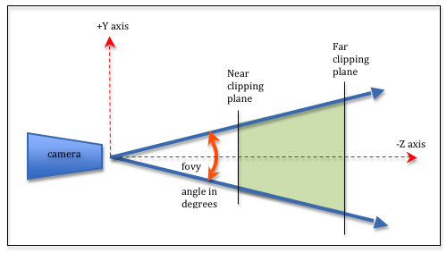

## Qualquer projeto ThreeJs consiste em quatro elementos principais

> O primeiro elemento é a Cena

> O segundo elemento é o Objects
>
> > O objeto no mundo ThreeJs é chamado de Malha

> O terceiro elemento é a Câmera

> O quarto elemento é o Renderizador

## Câmera

### podemos passar 4 argumentos para este tipo de câmera

> O primeiro argumento é o fov (campo de visão)

> O segundo argumento é a proporção

> O terceiro argumento é o valor próximo

> O quarto argumento é o valor distante

